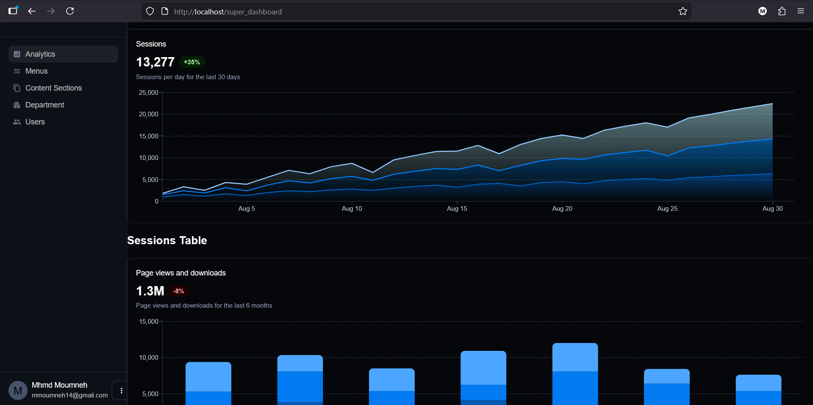
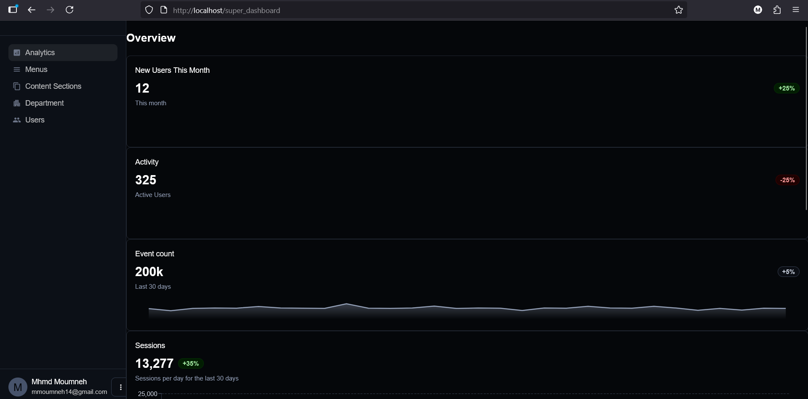
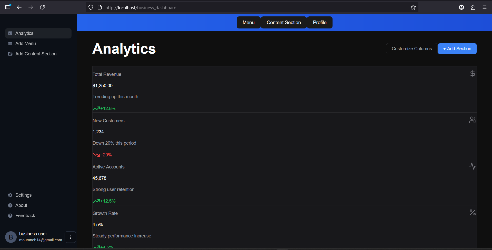
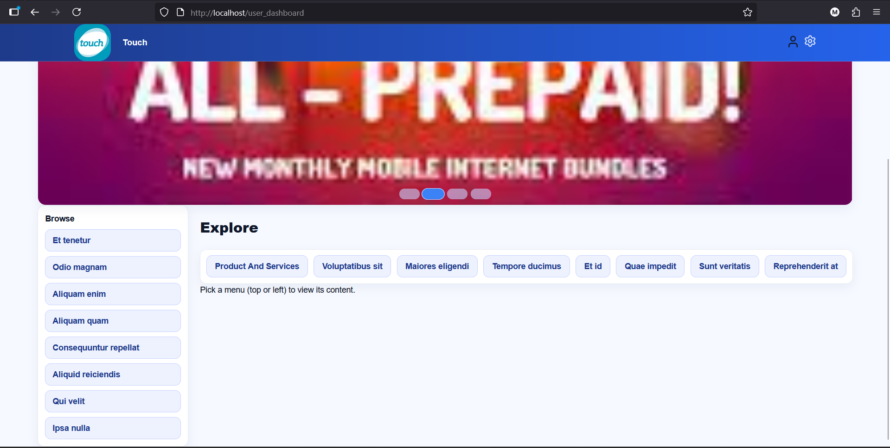

\# Touch CMS — Public Showcase

\*\*TL;DR:\*\* Modular CMS for multi-role content workflows (Super Admin / Business Admin / User).  

This repository contains \*\*showcase assets only\*\* (no source code).

\## What it does

\- Centralizes content creation, approval, and publishing

\- Role-based dashboards and permissions

\- Menu \& content hierarchy with ordering

\- Lightweight analytics and feedback

\## How it’s built

\- Backend: REST API

\- Frontend: SPA UI

\- Data: Relational DB  

\*(Details intentionally omitted.)\*

## Screens

\## Status

\- ✅ Core flows live

\- 🔜 Advanced analytics \& bulk ops

\## My role

Backend design, frontend design, DB modeling, auth flows, SPA UI, CI/CD basics.

\## License / Usage

Copyright © 2025 Mohamad Moumneh. \*\*All rights reserved.\*\*  

This showcase is for review only. No copying, reuse, or distribution without written permission.  

See \*\*LICENSE\*\* for full terms.

\*\*Contact:\*\* \[mmoumneh14@gmail.com](mailto:mmoumneh14@gmail.com) • \[LinkedIn](https://www.linkedin.com/in/mhmdmoumneh)

